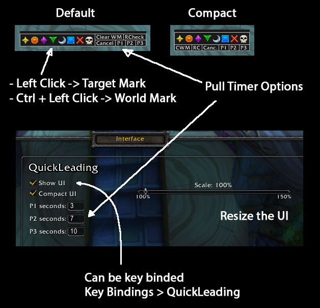

<h1>QuickLeading</h1>
WoW Client Version: 7.3.5 (Legion)

QuickLeading addon offers a set of quick commands for quick leading.

Features:

<ul>
    <li>
    Target/Word Marks
        <ul>
            <li>Left Click --> Target Mark</li>
            <li>Ctrl + Left Click --> World Mark</li>
        </ul>
    </li>
    <li>Clear Word Marks (WMarks)</li>
    <li>Ready Check</li>
    <li>Pull 7/10 seconds</li>
    <li>Stop pull</li>
    <li>Command `/qlpull` for custom timer</li>
</ul>

UI Modes:

<ul>
    <li>Linear (Default)</li>
    <li>Compact</li>
</ul>

Setup Interface (Interface > AddOns > QuickLeading)

Key binding for toggling UI (Key Bindings > QuickLeading)

<b>The Pull commands have been tested on DBM and BigWigs.</b>
 

Author: DoomFury - Felsong (private-server)

If you have any suggestion or found a bug, feel free to type me in game, or create an issue on Github.

